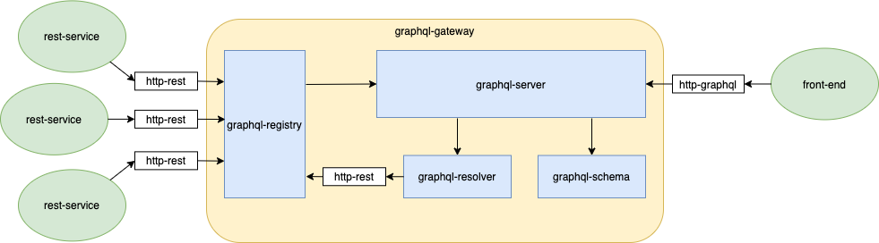
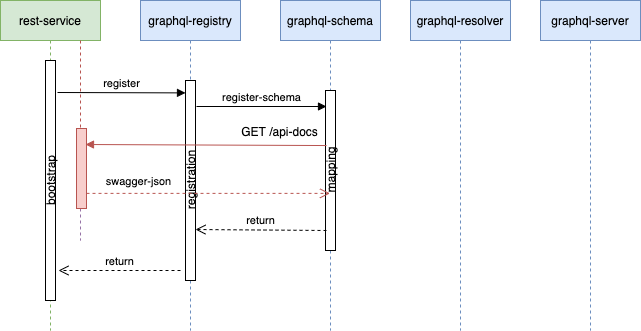
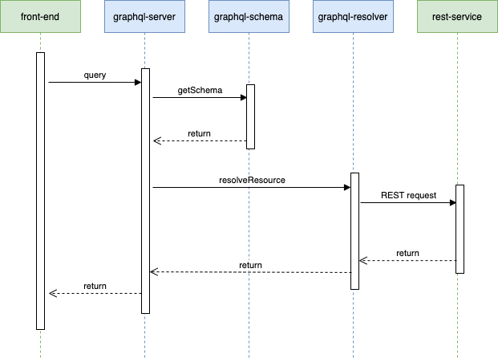
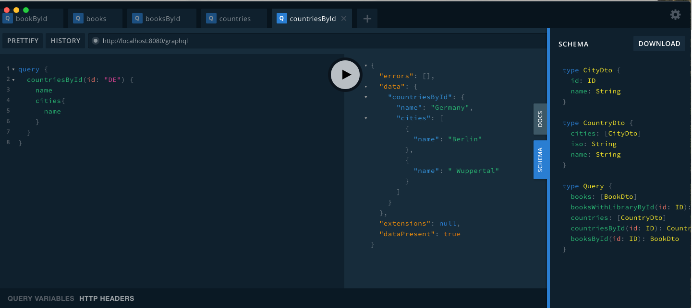

# graphql-gateway
Gateway to expose rest services using GraphQL.

## Overview


## Modules
### graphql-server
Exposes the endpoint **POST /graphql** for query requests

```graphql
query {
  countriesById(id: "DE") {
    name
    cities{
      name
    }
  }
}
```

```graphql
type CityDto {
  id: ID
  name: String
}

type CountryDto {
  cities: [CityDto]
  iso: String
  name: String
}
```
### graphql-registry
Exposes the following endpoints to manage registration of services:  

**POST /registry** to register services in the gateway
```shell
curl --location --request POST 'http://localhost:8080/registry' \
--header 'Content-Type: application/json' \
--data-raw '{
"name": "rest-countries-service",
"url": "http://localhost:8082/v2/api-docs"
}'
```
**DELETE /registry** to unregister services from the gateway
```shell
curl --location --request DELETE 'http://localhost:8080/registry?service=rest-countries-service' \
--header 'Content-Type: application/json' \
--data-raw '{
"name": "booksApi",
"url": "http://localhost:8081/v2/api-docs"
}'
```
**GET /registry** to list registered services in the gateway
```shell
curl --location --request GET 'http://localhost:8080/registry'
```

### graphql-registry-client
Includes the annotation **@GraphQLRegistryService** to register services during starting

### graphql-schema
Includes the code to map swagger with graphql

### graphql-gateway-server
springboot service that includes **graphql-server** and **grapqhl-registry**

## How it works
### Service registry

### Graphql queries

## Setup
Configuration of springboot service to register in graphql-gateway

#### Dependency with *graphql-registry-client*
```xml
<dependency>
    <groupId>org.formentor</groupId>
    <artifactId>graphql-registry-client</artifactId>
    <version>${graphql-gateway.version}</version>
</dependency>   
```
#### Annotation of spring boot class with *@GraphQLRegistryService*
```java
@SpringBootApplication
@GraphQLRegistryService
public class BooksApplication {
	public static void main(String[] args) {
		SpringApplication.run(BooksApplication.class, args);
	}
}
```
#### Configuration
Configuration of the url of the *graphql-gateway* in *application.yaml*
```yaml
graphql:
  registry:
    uri: http://localhost:8080
```
## Usage and example
1. Install
```shell
mvn clean package
```
2. Start *graphql-gateway*
```shell
java -jar graphql-gateway-server/target/graphql-gateway.jar
```
### Example
The project includes the samples *rest-books-service* and *rest-countries-service* to test the gateway   
#### Start *rest-books-service*
```shell
java -jar rest-books-service/target/*.jar
```
> The service *rest-books-service* will register the fields **books** and **booksById** in query type

```graphql
query {
    books {
        name
        id
        author {
            lastName
            firstName
        }
    }
}
```

```graphql
query {
  booksById(id: "one") {
    id
    name
    author {
      lastName
    }
  }
}
```

#### Start *rest_countries_service*
```shell
java -jar rest-countries-service/target/*.jar
```
> The service *rest-countries-service* will register the fields **countries** and **countriesById** in query type
```graphql
query {
    countries {
        iso
        name
        cities {
            name
            id
        }
    }
}
```

```graphql
query {
    countriesById(id: "DE") {
        name
        cities{
            name
        }
    }
}
```

#### Launch GraphQL queries using [GraphQL Playground](https://github.com/graphql/graphql-playground)
